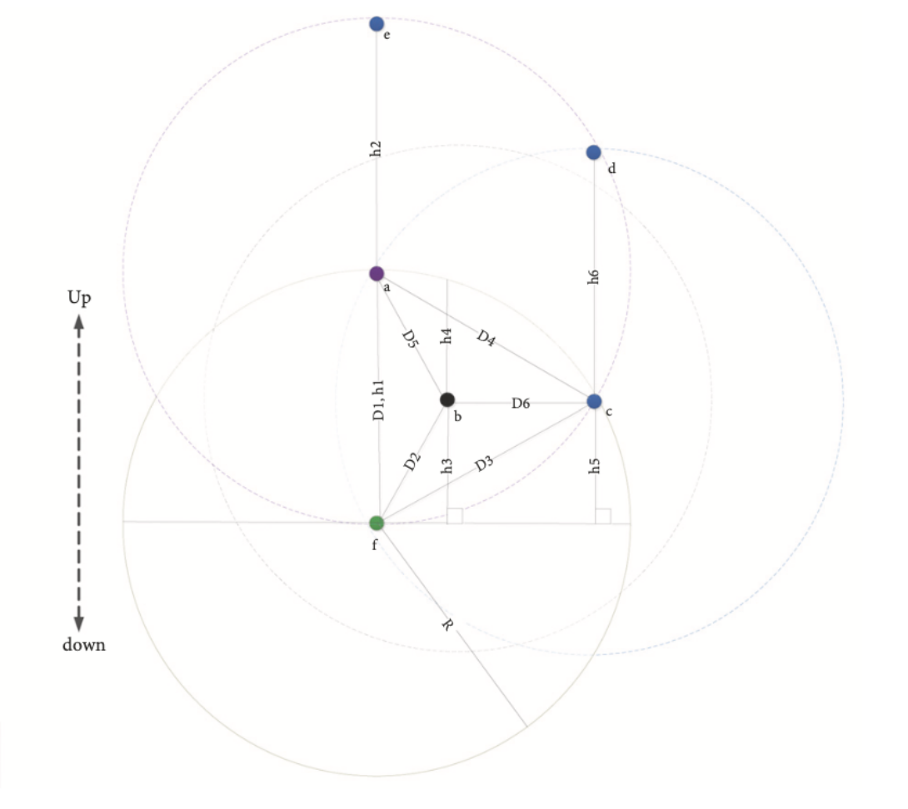

# SORP Protocol

#### 最佳候选节点的选择过程

1. **候选节点筛选**：从所有接收到控制包的邻居节点中筛选出候选节点，这些节点的深度必须小于当前节点的深度。
2. **EPA计算和排序**：计算每个候选节点的 EPA 值，并根据 EPA 值对候选节点进行排序。EPA 值越大，候选节点越优先。
3. **最佳节点选择**：选择 EPA 值最大的候选节点作为最佳候选节点，以最大化每一跳的数据传输推进。

### 转发时间和持有时间

**转发时间**通常指的是数据包从一个网络节点到达并准备离开该节点，直到实际开始在链路上进行传输的时间间隔。这个时间包括了节点处理数据包（如解封装、检查、可能的缓冲等待等）、做出转发决策以及实际开始传输前的所有准备过程。转发时间直接影响数据包在全网中的端到端延迟。

**持有时间（Holding Time 或 TTL, Time to Live）**是指数据包或路由信息在某个节点或网络中可以保持有效或存活的最长时间。超过这个时间，如果没有被转发或处理，数据包会被丢弃，或者路由信息会失效。持有时间的设定有助于防止数据包在环路中无限循环，同时也是管理网络资源、避免过时信息传播的一种机制。

### 计算转发时间基于两条的视角

1. **优化转发决策**：通过考虑两跳节点（即当前转发节点到下一个最佳候选节点，以及该候选节点到其下一个最佳转发节点）的深度差异总和（用H表示），SORP能够更加全面地评估数据包的潜在前进进度。这有助于选出具有最大预期包推进（EPA）的路径，即使当前节点不是直接将数据包推向目的地的最佳节点，也能确保数据包沿着整体最优路径前进。
2. **抑制重复传输**：计算转发时间时考虑两跳进展，可以更精确地设置节点的持有时间（holding time, T_hold）。这样做能确保当存在更优节点准备转发数据时，较低优先级的节点不会同时发送，从而避免了不必要的数据包复制和碰撞，节省了网络资源和能量。
3. **动态调整延迟与可靠性**：在SORP中，方程(29)的前半部分确保了基于两跳进展的候选转发节点优先级，而后半部分补偿了从当前转发节点到所有候选转发节点的传播延迟。通过预设的最大延迟（T_Delay）调整，可以在延迟和能量消耗之间找到平衡点。较长的T_Delay虽然可能导致单个数据包的端到端延迟增加，但可以更有效地抑制较低优先级节点的传输，从而节约能量；相反，较短的T_Delay虽能减少延迟和丢包率，但可能因无法有效抑制低优先级节点而增加能耗。
4. **适应动态网络条件**：在动态变化的水下环境中，基于两跳的计算方法能够更灵活地适应网络拓扑变化，尤其是在处理阴影区域和传播速度变化时。通过考虑下一跳节点的状况，节点能够更快地对网络状态变化做出反应，减少因信息陈旧导致的重传。

#### 更新间隔的优化

1. **网络密度感知**：SORP 会感知网络的密度变化，并动态调整更新间隔。在密集网络中，更新间隔可以稍长，以减少控制包的传输和能量消耗；在稀疏网络中，更新间隔可以稍短，以确保邻居信息的及时更新。
2. **定时器机制**：节点会启动一个更新定时器，定时器到期时节点会广播一个控制包，更新邻居节点信息并重新计算最佳候选节点。
3. **实验验证**：
    - **25秒**：较短的更新间隔适用于稀疏网络，可以提高包投递率并减少延迟和能量消耗。
    - **75秒**：较长的更新间隔在密集网络中可以减少不必要的控制包传输，但可能导致信息过时。

**转发时间例子**

假设节点𝑓为当前转发节点，候选节点为`a,𝑏,c`，转发区域范围设置为最大值，即𝑅。

> 节点𝑎和𝑐也被认为是候选转发节点，因为它们到节点𝑏的距离小于𝑅。 

考虑`𝛼 = 0.5`，`𝐷1 = h1 = h2 = 𝑅`，当节点𝑎收到数据包时，它会毫无延迟地转发数据包，因为节点𝑎及其下一跳邻居节点𝑒向上的 EPA 最高。 到节点𝑎距离`𝐷4 = 𝑅`的最远候选转发节点是节点𝑐，只要其持有时间大于`𝑅/v𝑠𝑜𝑢𝑛𝑑`即可被抑制。

令`h5 = 𝑅/2`且`h6 = 𝐷3 = 𝑅`，则对于节点𝑐， `𝐻 = 0.5𝑅/2 + (1 − 0.5)𝑅 = 3𝑅/4`，随后 `𝑇h𝑜𝑙𝑑 = (𝑅 − 3𝑅/4)𝑇𝐷𝑒𝑙𝑎𝑦/𝑅 + (𝑅 − 𝑅)/v𝑠 𝑜𝑢𝑛𝑑 = 1/4𝑇𝐷𝑒𝑙𝑎𝑦`。 因此，如果`𝑇𝐷𝑒𝑙𝑎𝑦`大于`4𝑅/v𝑠𝑜𝑢𝑛𝑑`，则在向节点𝑑发送重复数据包之前，节点c可以听到来自节点𝑎的数据包传输给d的数据包。 

此外，节点𝑏在候选转发节点中具有最低优先级，因为它只能看到自身上方的节点𝑎。令 `h3 = h4 = 𝐷2 = 𝐷5 = 𝐷6 = 𝑅/2` 且`𝑇𝐷𝑒𝑙𝑎𝑦 = 4𝑅/v𝑠𝑜𝑢𝑛𝑑`，则对于节点 𝑏，`𝐻 = 𝑅/2` 和 `𝑇h𝑜𝑙𝑑 = (𝑅 − 𝑅/2)4𝑅/𝑅v𝑠𝑜𝑢𝑛𝑑 + (𝑅 − 𝑅/2)/v𝑠𝑜𝑢𝑛𝑑 = 2.5𝑅/v𝑠𝑜𝑢𝑛𝑑`。 因此，如果那些高优先级节点𝑎或𝑐之一成功传输，则可以抑制来自节点𝑏的数据包转发，因为在接收到来自节点𝑓的数据包后，它可以在 `R/v𝑠𝑜𝑢𝑛𝑑` 和 `2𝑅/v𝑠𝑜𝑢𝑛𝑑` 之后听到节点𝑎或𝑐的数据包传输完成。

#### 可变传播延迟问题解决

**问题描述**：
在不同深度和温度下，可变的传播延迟是另一个影响水下路由协议性能的问题。水下声速（通常在1450至1540m/s之间）会影响端到端延迟（EED）。由于水声速在不同条件下会有所变化，这种变化会导致数据包传播速度的差异。

**影响分析**：

声速的变化会影响机会数据转发中持有时间的计算。由于不同深度和温度条件下声速的差异，网络可以根据深度将其划分为若干层。在部署时，每个节点根据深度信息知道自己属于哪一层，因此可以在持有时间计算中考虑更准确的声速值，从而提高在具有可变传播延迟的水下环境中的机会数据转发性能。
